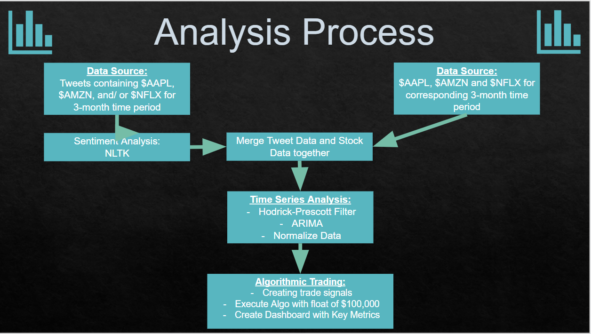

## Project Two

1) Pull whole repository to local drive
2) Follow Process Map below to execute code

## Imports Needed:
-	import pandas as pd
-	from pathlib import Path
-	import nltk
-	from nltk.sentiment.vader import SentimentIntensityAnalyzer
-	from nltk.corpus import reuters, stopwords
-	from nltk.tokenize import word_tokenize, sent_tokenize
-	from nltk.corpus import stopwords
-	from nltk.stem import WordNetLemmatizer
-	from string import punctuation
-	import re
-	nltk.download('vader_lexicon')
-	import numpy as np
-	import hvplot.pandas
-	%matplotlib inline
-	import warnings
-	warnings.simplefilter(action='ignore', category=Warning)
-	from statsmodels.tsa.arima_model import ARIMA
-	from sklearn.linear_model import LinearRegression
-	from sklearn.metrics import mean_squared_error
-	from IPython.display import Markdown

## Objective:
To develop a program that analyzes the correlation and potential causation of social sentiment on popular consumer-focused stocks: Netflix, Amazon, and Apple. We decided to choose these three stocks as the companies are heavily consumer focused and the brand value is reliant on consumer perceptions. In addition, people tend to have very strong opinions (either positive or negative) about these companies. We will also be defining the social sentiment into three levels – positive, neutral and negative.

## Step 1 - Sentiment Analysis (Working-Code/Equity_Sentiment.ipynb):
We performed sentiment analysis on all tweets that contained AAPL, NFLX, and/or AMZN (csv files in Tweet-data folder). The time frame that we used was three months from April to June 2016. This provided us with a positive, negative, neutral and compound score for each tweet (exported to csv files “ticker”_sentiment.csv in ) We grouped this data by date and used the daily compound score for our regression analysis.

## Step 2 - Data Consolidation (Merged_data Folder)
We merged the data of the sentiment analysis and that of the stock data. Then cleaned and isolated the overall sentiment (Compound) and the Return value for each ticker. Found the correlation and plotted the data to visualize and see what information we could extract. We also extracted live data from 2016/04/02 - 2016/06/15 and also of the last 30 days of this year and applied sharpe ratio and sortino ratio in hopes to use it for the Algorithmic trading tool for application to real-time stock market data.

## Step 3 - Time Series Analysis (Stock-Analysis Folder/ stock_regression_analsys.ipynb)
Purpose of Time Series Analysis is to determine what impact the twitter sentiment, 5 day and 8 day lagged data has on future returns. We performed individual ARIMA time series analysis on all equities of our sentiment analysis from April through June 2016.
Values of focus:
-	Adjusted closing price
-	Daily return
-	Lagged daily return
-	Lagged net sentiment score (derived from sentiment analysis)

Daily return and lagged daily returns were normalized to generate all positive numbers for predictive modelling purposes. The end result – demonstrate in the graphs below – was that the sentiment score of a stock was not an effective predictor of the stock future price fluctuations. As you can see in the graphs below for the Amazon stock the future price forecast for 5- and 8-day lags have the same trend as the actual stock price for the next 5 trading days.

## Step 4 - Trading Algorithm (Stock-Analysis Folder/ “ticker”_5_8_ARIMA2.ipynb)
We then created a trading algorithm for each stock: AAPL, AMZN, and NFLX
1.	Generated a Dual Moving Average Crossover Trading Signal for time periods of 5 and 8 days
2.	Backtested the Trading Strategy with an initial investment of 100,000
3.	Evaluated the Trading Algo with a resulting a 11% profit with first trade and a 1.4% profit
4.	Created a Trading Dashboard displaying the key metrics and trade details of the trading algorithm

## Future Work
We were also successful in creating a live function which allows us to get the 100 most recent tweets on a certain subject and perform a vader sentiment analysis on it and provide a mean of the compound score. If we had more time we would have used this data, live stock data, our model from the regressions analysis and our algorithmic trading tool to create a sentiment algorithmic trading tool. (In the Live_data folder)

